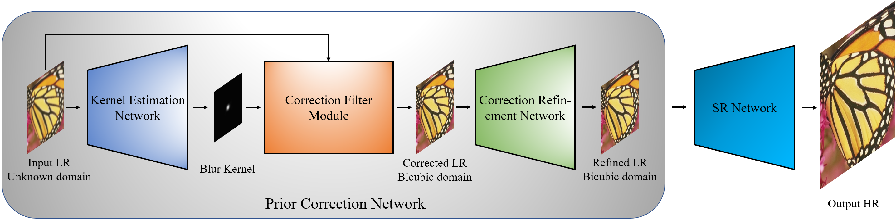
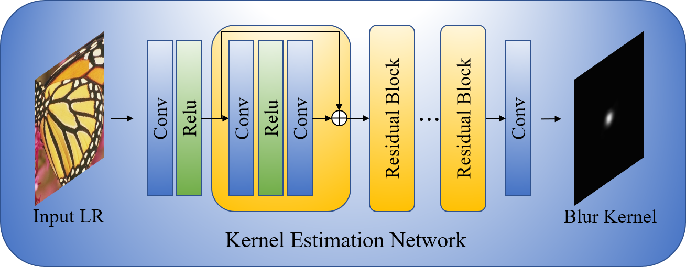

# PCNet
Pytorch implementation of "Blind Image Super-Resolution Based on Prior Correction Network"


## Overview

<p align="center">  </p>


<p align="center">  </p>


<p align="center">  </p>


## Requirements
- Python 3.6
- PyTorch == 1.7.0
- numpy
- skimage
- imageio
- matplotlib
- cv2


## Train
### 1. Prepare training data 

1.1 Download the [DIV2K](https://data.vision.ee.ethz.ch/cvl/DIV2K/)  dataset and the [Flickr2K](http://cv.snu.ac.kr/research/EDSR/Flickr2K.tar) dataset.

### 2. Begin to train or test
Run `src/demo.sh` to train or test your dataset.


## Citation
```

```

## Acknowledgements
This code is built on [EDSR (PyTorch)](https://github.com/thstkdgus35/EDSR-PyTorch), [Correction-Filter](https://github.com/shadyabh/Correction-Filter) and [USRNet](https://github.com/cszn/USRNet). We thank the authors for sharing the codes.

